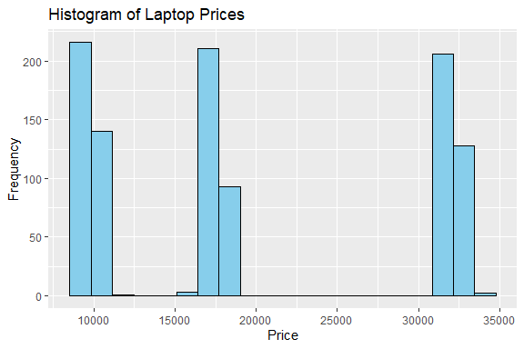
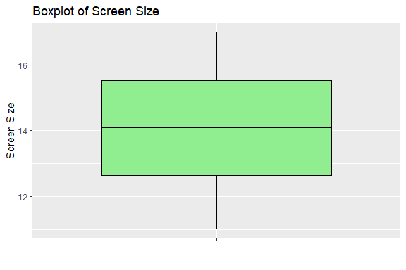
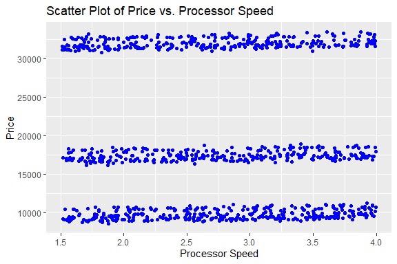

Laptop Price Prediction
================
Trevor Okinda
2024

- [Student Details](#student-details)
- [Setup Chunk](#setup-chunk)
  - [Source:](#source)
  - [Reference:](#reference)
- [Understanding the Dataset (Exploratory Data Analysis
  (EDA))](#understanding-the-dataset-exploratory-data-analysis-eda)
  - [Loading dataset](#loading-dataset)
  - [Measures of Frequency](#measures-of-frequency)
  - [Measures of Central Tendency](#measures-of-central-tendency)
  - [Measures of Distribution](#measures-of-distribution)
  - [Measures of Relationship](#measures-of-relationship)
  - [ANOVA](#anova)
  - [Plots](#plots)
- [Preprocessing and Data
  Transformation](#preprocessing-and-data-transformation)
  - [Missing Values](#missing-values)
- [Model Training](#model-training)
  - [Data Splitting](#data-splitting)
  - [Bootstrapping](#bootstrapping)
  - [Cross-validation](#cross-validation)
  - [Training Different Models](#training-different-models)
  - [Saving Model](#saving-model)

# Student Details

|                       |                         |
|-----------------------|-------------------------|
| **Student ID Number** | 134780                  |
| **Student Name**      | Trevor Okinda           |
| **BBIT 4.2 Group**    | C                       |
| **Project Name**      | Laptop Price Prediction |

# Setup Chunk

**Note:** the following KnitR options have been set as the global
defaults: <BR>
`knitr::opts_chunk$set(echo = TRUE, warning = FALSE, eval = TRUE, collapse = FALSE, tidy = TRUE)`.

More KnitR options are documented here
<https://bookdown.org/yihui/rmarkdown-cookbook/chunk-options.html> and
here <https://yihui.org/knitr/options/>.

### Source:

The dataset that was used can be downloaded here: *\<<a
href="https://www.kaggle.com/datasets/mrsimple07/laptoppriceprediction\"
class="uri">https://www.kaggle.com/datasets/mrsimple07/laptoppriceprediction\</a>\>*

### Reference:

*\<Abdurakhimov, M. (2024). Laptop Price Prediction \[Dataset\]. Kaggle.
<a
href="https://www.kaggle.com/datasets/mrsimple07/laptoppriceprediction\"
class="uri">https://www.kaggle.com/datasets/mrsimple07/laptoppriceprediction\</a>\>  
Refer to the APA 7th edition manual for rules on how to cite datasets:
<https://apastyle.apa.org/style-grammar-guidelines/references/examples/data-set-references>*

# Understanding the Dataset (Exploratory Data Analysis (EDA))

## Loading dataset

``` r
# Load the required packages
library(dplyr)
```

    ## 
    ## Attaching package: 'dplyr'

    ## The following objects are masked from 'package:stats':
    ## 
    ##     filter, lag

    ## The following objects are masked from 'package:base':
    ## 
    ##     intersect, setdiff, setequal, union

``` r
library(psych)

# Load dataset
laptop_data <- read.csv("Laptop_price.csv", colClasses = c(
  Brand = "factor",
  Processor_Speed = "numeric",
  RAM_Size = "factor",
  Storage_Capacity = "factor",
  Screen_Size = "numeric",
  Weight = "numeric",
  Price = "numeric"
))
```

## Measures of Frequency

``` r
# Define a function to calculate mode
Mode <- function(x) {
  ux <- unique(x)
  ux[which.max(tabulate(match(x, ux)))]
}


# Measures of Frequency
# Frequency table for Brand
brand_freq <- table(laptop_data$Brand)
print("Frequency table for Brand:")
```

    ## [1] "Frequency table for Brand:"

``` r
print(brand_freq)
```

    ## 
    ##   Acer   Asus   Dell     HP Lenovo 
    ##    204    206    210    190    190

## Measures of Central Tendency

``` r
# Measures of Central Tendency
# Mean, Median, and Mode for Price
price_mean <- mean(laptop_data$Price)
price_median <- median(laptop_data$Price)
price_mode <- Mode(laptop_data$Price)
print("Measures of Central Tendency for Price:")
```

    ## [1] "Measures of Central Tendency for Price:"

``` r
print(paste("Mean:", price_mean))
```

    ## [1] "Mean: 19604.187963253"

``` r
print(paste("Median:", price_median))
```

    ## [1] "Median: 17287.24188"

``` r
print(paste("Mode:", price_mode))
```

    ## [1] "Mode: 17395.09306"

## Measures of Distribution

``` r
# Measures of Distribution
# Standard Deviation and Range for Screen Size
screen_sd <- sd(laptop_data$Screen_Size)
screen_range <- range(laptop_data$Screen_Size)
print("Measures of Distribution for Screen Size:")
```

    ## [1] "Measures of Distribution for Screen Size:"

``` r
print(paste("Standard Deviation:", screen_sd))
```

    ## [1] "Standard Deviation: 1.7058818318525"

``` r
print(paste("Range:", screen_range))
```

    ## [1] "Range: 11.01211111" "Range: 16.98573693"

## Measures of Relationship

``` r
# Measures of Relationship
# Correlation between Processor Speed and Price
processor_price_corr <- cor(laptop_data$Processor_Speed, laptop_data$Price)
print("Correlation between Processor Speed and Price:")
```

    ## [1] "Correlation between Processor Speed and Price:"

``` r
print(processor_price_corr)
```

    ## [1] -0.05073733

``` r
# Correlation between RAM Size and Price
# Since RAM Size is currently a factor, we need to convert it to numeric first
laptop_data$RAM_Size <- as.numeric(as.character(laptop_data$RAM_Size))
ram_price_corr <- cor(laptop_data$RAM_Size, laptop_data$Price)
print("Correlation between RAM Size and Price:")
```

    ## [1] "Correlation between RAM Size and Price:"

``` r
print(ram_price_corr)
```

    ## [1] 0.06123674

## ANOVA

``` r
# Load the required packages
library(dplyr)

# Convert RAM_Size and Storage_Capacity to factors
laptop_data$RAM_Size <- as.factor(laptop_data$RAM_Size)
laptop_data$Storage_Capacity <- as.factor(laptop_data$Storage_Capacity)

# Perform ANOVA on Brand
anova_brand <- aov(Price ~ Brand, data = laptop_data)
print(summary(anova_brand))
```

    ##              Df    Sum Sq  Mean Sq F value Pr(>F)
    ## Brand         4 1.934e+08 48347773   0.545  0.702
    ## Residuals   995 8.819e+10 88635368

``` r
# Post-hoc tests for pairwise comparisons
pairwise_tukey <- TukeyHSD(anova_brand)
print(pairwise_tukey)
```

    ##   Tukey multiple comparisons of means
    ##     95% family-wise confidence level
    ## 
    ## Fit: aov(formula = Price ~ Brand, data = laptop_data)
    ## 
    ## $Brand
    ##                     diff       lwr      upr     p adj
    ## Asus-Acer    -130.375343 -2671.654 2410.903 0.9999131
    ## Dell-Acer   -1118.603642 -3647.812 1410.604 0.7463963
    ## HP-Acer      -614.850690 -3208.823 1979.121 0.9670652
    ## Lenovo-Acer    -9.683895 -2603.656 2584.288 1.0000000
    ## Dell-Asus    -988.228299 -3511.201 1534.744 0.8217357
    ## HP-Asus      -484.475347 -3072.368 2103.417 0.9862266
    ## Lenovo-Asus   120.691448 -2467.201 2708.584 0.9999406
    ## HP-Dell       503.752952 -2072.287 3079.793 0.9837802
    ## Lenovo-Dell  1108.919747 -1467.120 3684.960 0.7649417
    ## Lenovo-HP     605.166795 -2034.489 3244.822 0.9708198

## Plots

``` r
library(ggplot2)
```

    ## 
    ## Attaching package: 'ggplot2'

    ## The following objects are masked from 'package:psych':
    ## 
    ##     %+%, alpha

``` r
# Univariate Plots
# Histogram for Price
histogram_price <- ggplot(laptop_data, aes(x = Price)) +
  geom_histogram(fill = "skyblue", color = "black", bins = 20) +
  labs(title = "Histogram of Laptop Prices", x = "Price", y = "Frequency")
print(histogram_price)
```

<!-- -->

``` r
# Boxplot for Screen Size
boxplot_screen_size <- ggplot(laptop_data, aes(x = "", y = Screen_Size)) +
  geom_boxplot(fill = "lightgreen", color = "black") +
  labs(title = "Boxplot of Screen Size", x = "", y = "Screen Size")
print(boxplot_screen_size)
```

<!-- -->

``` r
# Multivariate Plot
# Scatter plot of Price vs. Processor Speed
scatter_price_processor <- ggplot(laptop_data, aes(x = Processor_Speed, y = Price)) +
  geom_point(color = "blue") +
  labs(title = "Scatter Plot of Price vs. Processor Speed", x = "Processor Speed", y = "Price")
print(scatter_price_processor)
```

<!-- -->

# Preprocessing and Data Transformation

## Missing Values

``` r
# Check for NA values in the dataset
na_count <- sum(is.na(laptop_data))
print(paste("Number of NA values in the dataset:", na_count))
```

    ## [1] "Number of NA values in the dataset: 0"

``` r
# Check for NULL values in the dataset
null_count <- sum(is.null(laptop_data))
print(paste("Number of NULL values in the dataset:", null_count))
```

    ## [1] "Number of NULL values in the dataset: 0"

``` r
# Check for missing values in specific columns
missing_values_brand <- sum(is.na(laptop_data$Brand))
print(paste("Number of missing values in Brand column:", missing_values_brand))
```

    ## [1] "Number of missing values in Brand column: 0"

``` r
missing_values_price <- sum(is.na(laptop_data$Price))
print(paste("Number of missing values in Price column:", missing_values_price))
```

    ## [1] "Number of missing values in Price column: 0"

# Model Training

## Data Splitting

``` r
library(caret)
```

    ## Loading required package: lattice

``` r
# Data Splitting
set.seed(123) # for reproducibility
train_index <- createDataPartition(laptop_data$Price, p = 0.8, list = FALSE)
train_data <- laptop_data[train_index, ]
test_data <- laptop_data[-train_index, ]

dim(train_data)
```

    ## [1] 800   7

``` r
dim(test_data)
```

    ## [1] 200   7

## Bootstrapping

``` r
# Bootstrapping
bootstrapped_means <- replicate(1000, mean(sample(train_data$Price, replace = TRUE)))
bootstrapped_sd <- sd(bootstrapped_means)
print(paste("Bootstrapped Standard Deviation of means:", bootstrapped_sd))
```

    ## [1] "Bootstrapped Standard Deviation of means: 330.485575653784"

## Cross-validation

``` r
# Cross-validation
set.seed(123) # for reproducibility
fit_control <- trainControl(method = "cv", number = 5)
model <- train(Price ~ ., data = train_data, method = "lm", trControl = fit_control)
print(summary(model))
```

    ## 
    ## Call:
    ## lm(formula = .outcome ~ ., data = dat)
    ## 
    ## Residuals:
    ##     Min      1Q  Median      3Q     Max 
    ## -602.54 -132.74    0.18  128.64  854.82 
    ## 
    ## Coefficients:
    ##                       Estimate Std. Error   t value Pr(>|t|)    
    ## (Intercept)          30720.675     74.031   414.971  < 2e-16 ***
    ## BrandAsus               33.402     21.570     1.549 0.121894    
    ## BrandDell              -17.500     21.954    -0.797 0.425624    
    ## BrandHP                 -7.760     22.836    -0.340 0.734080    
    ## BrandLenovo              1.539     21.949     0.070 0.944108    
    ## Processor_Speed        197.806      9.475    20.876  < 2e-16 ***
    ## RAM_Size8              205.201     20.080    10.219  < 2e-16 ***
    ## RAM_Size16             607.307     20.184    30.089  < 2e-16 ***
    ## RAM_Size32            1422.522     19.581    72.649  < 2e-16 ***
    ## Storage_Capacity256 -22298.644     16.901 -1319.347  < 2e-16 ***
    ## Storage_Capacity512 -14630.933     17.438  -839.011  < 2e-16 ***
    ## Screen_Size             15.383      4.124     3.730 0.000205 ***
    ## Weight                  -4.171      8.106    -0.515 0.606992    
    ## ---
    ## Signif. codes:  0 '***' 0.001 '**' 0.01 '*' 0.05 '.' 0.1 ' ' 1
    ## 
    ## Residual standard error: 196.6 on 787 degrees of freedom
    ## Multiple R-squared:  0.9996, Adjusted R-squared:  0.9996 
    ## F-statistic: 1.525e+05 on 12 and 787 DF,  p-value: < 2.2e-16

``` r
print(model)
```

    ## Linear Regression 
    ## 
    ## 800 samples
    ##   6 predictor
    ## 
    ## No pre-processing
    ## Resampling: Cross-Validated (5 fold) 
    ## Summary of sample sizes: 640, 640, 640, 640, 640 
    ## Resampling results:
    ## 
    ##   RMSE      Rsquared   MAE     
    ##   198.9543  0.9995565  156.1155
    ## 
    ## Tuning parameter 'intercept' was held constant at a value of TRUE

## Training Different Models

``` r
# Load the required packages
library(caret)
library(rpart)
library(randomForest)
```

    ## randomForest 4.7-1.1

    ## Type rfNews() to see new features/changes/bug fixes.

    ## 
    ## Attaching package: 'randomForest'

    ## The following object is masked from 'package:ggplot2':
    ## 
    ##     margin

    ## The following object is masked from 'package:psych':
    ## 
    ##     outlier

    ## The following object is masked from 'package:dplyr':
    ## 
    ##     combine

``` r
# Data Splitting
set.seed(123) # for reproducibility
train_index <- createDataPartition(laptop_data$Price, p = 0.8, list = FALSE)
train_data <- laptop_data[train_index, ]
test_data <- laptop_data[-train_index, ]

# Linear Regression (lm)
lm_model <- lm(Price ~ ., data = train_data)
print(summary(lm_model))
```

    ## 
    ## Call:
    ## lm(formula = Price ~ ., data = train_data)
    ## 
    ## Residuals:
    ##     Min      1Q  Median      3Q     Max 
    ## -602.54 -132.74    0.18  128.64  854.82 
    ## 
    ## Coefficients:
    ##                       Estimate Std. Error   t value Pr(>|t|)    
    ## (Intercept)          30720.675     74.031   414.971  < 2e-16 ***
    ## BrandAsus               33.402     21.570     1.549 0.121894    
    ## BrandDell              -17.500     21.954    -0.797 0.425624    
    ## BrandHP                 -7.760     22.836    -0.340 0.734080    
    ## BrandLenovo              1.539     21.949     0.070 0.944108    
    ## Processor_Speed        197.806      9.475    20.876  < 2e-16 ***
    ## RAM_Size8              205.201     20.080    10.219  < 2e-16 ***
    ## RAM_Size16             607.307     20.184    30.089  < 2e-16 ***
    ## RAM_Size32            1422.522     19.581    72.649  < 2e-16 ***
    ## Storage_Capacity256 -22298.644     16.901 -1319.347  < 2e-16 ***
    ## Storage_Capacity512 -14630.933     17.438  -839.011  < 2e-16 ***
    ## Screen_Size             15.383      4.124     3.730 0.000205 ***
    ## Weight                  -4.171      8.106    -0.515 0.606992    
    ## ---
    ## Signif. codes:  0 '***' 0.001 '**' 0.01 '*' 0.05 '.' 0.1 ' ' 1
    ## 
    ## Residual standard error: 196.6 on 787 degrees of freedom
    ## Multiple R-squared:  0.9996, Adjusted R-squared:  0.9996 
    ## F-statistic: 1.525e+05 on 12 and 787 DF,  p-value: < 2.2e-16

``` r
# Decision Tree
tree_model <- rpart(Price ~ ., data = train_data)
print(tree_model)
```

    ## n= 800 
    ## 
    ## node), split, n, deviance, yval
    ##       * denotes terminal node
    ## 
    ## 1) root 800 70738940000 19664.140  
    ##   2) Storage_Capacity=256,512 529  7881204000 13324.980  
    ##     4) Storage_Capacity=256 283   102662300  9770.613 *
    ##     5) Storage_Capacity=512 246    90240850 17413.940 *
    ##   3) Storage_Capacity=1000 271   103896200 32038.370 *

## Saving Model

``` r
# Load the saved model
loaded_lm_model <- readRDS("./models/saved_lm_model.rds")

# Prepare new data for prediction
new_data <- data.frame(
  Brand = factor("Asus"),
  Processor_Speed = as.numeric(3.0),
  RAM_Size = factor("8"),
  Storage_Capacity = factor("512"),
  Screen_Size = as.numeric(15.6),
  Weight = as.numeric(3.5)
)

# Use the loaded model to make predictions
predictions_loaded_model <- predict(loaded_lm_model, newdata = new_data)

# Print predictions
print(predictions_loaded_model)
```

    ##        1 
    ## 17147.15
